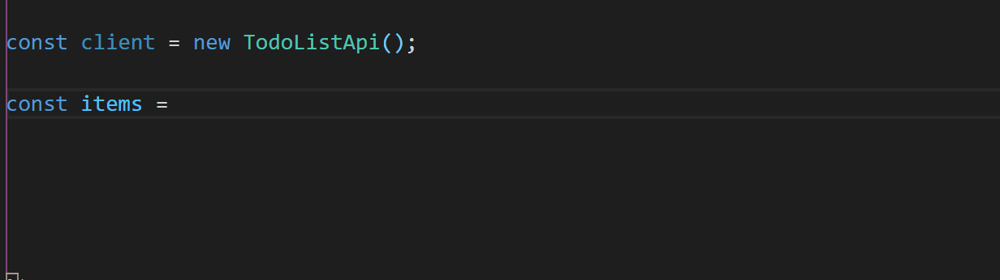

### Motivation

[OpenAPI](https://swagger.io/docs/specification/about/) is becoming one of the *de facto* standards for specifying, documenting, and implementing REST-like HTTP APIs. The ecosystem is impressive, with [hundreds of code generators](https://openapi-generator.tech/docs/generators) for many environments including [TypeScript + fetch](https://github.com/OpenAPITools/openapi-generator/blob/master/docs/generators/typescript-fetch.md), [documentation generators](https://github.com/Redocly/redoc), and more.

One of the core benefits of using a TypeScript generator is that the generated client is strongly typed without any additional effort, which gives better code safety and auto-completion:



This module provides a first-class integration of an auto-generated client for use in React components:

```tsx
  const [items, invalidate] = useOpenApiFetch((c) => c.getItems(), []);

  const toggleItem = useOpenApiCallback(
    (client, item: Item) =>
      client
        .putItem({
          itemId: item.id,
          item: {
            ...item,
            done: !item.done,
          },
        })
        .then(() => invalidate(items)),
    [items],
  );

  // ...

  return (
    <ul>
      {items.value.map((item) => (
        <li key={item.id}>
          <h2>{item.title}</h2>
          <details>{item.description}</details>
          <input
            type="checkbox"
            checked={item.done}
            onClick={() => toggleItem(item)}
            readOnly
          />
        </li>
      ))}
    </ul>
  );
```

### Installation and usage
  1. Install this package:
```
$ npm i typed-react-openapi
```

  2. Generate a TypeScript client from your OpenAPI spec:
```
$ npm i --save-dev @openapitools/openapi-generator-cli
$ ./node_modules/.bin/openapi-generator generate -i spec.yml -g typescript-fetch -c config.yml
```

See [the example config file](src/example/config.yml) and the [typescript-fetch documentation](https://github.com/OpenAPITools/openapi-generator/blob/master/docs/generators/typescript-fetch.md).

  3. Initialize this module using the generated client:
```ts
import { MyApi } from "my-openapi-client-package";

const {
  OpenApiProvider,
  useOpenApiFetch,
  useOpenApiCallback,
} = createOpenApi(config => new MyApi(config));
```

  4. Provide a context in your component tree:

```tsx
const configuration = useMemo(
  (): IConfiguration => ({
    basePath: "http://localhost:8080",
    headers: token
      ? {
          authorization: `Bearer ${token}`,
        }
      : {},
  }),
  [token],
);

return (
  <OpenApiProvider configuration={configuration}>
    {/* ... */}
  </OpenApiProvider>
);
```

  5. Use it in your components:

  ```tsx
    const [items] = useOpenApiFetch(c => c.getItems(), []);
     
    const updateItem = useOpenApiCallback((c, item) => c.putItem({ id: item.id, item }), []);
  ```

See a [complete example](src/example) for a full integration.

### API

To use the lib, your must initialize it with your generated API client:
```ts
import { createOpenApi } from "typed-react-openapi";
import { MyApiClient } from "my-generated-api-package";

const { OpenApiProvider, useOpenApiFetch, useOpenApiCallback, useOpenApiClient } = createOpenApi(config => new MyApiClient(config));
```

It is possible to have multiple instances for different API clients:

```ts
import { MyApiClient1, MyApiClient2 } from "my-generated-api-package";

const openApi1 = createOpenApi(config => new MyApiClient1(config));
const openApi2 = createOpenApi(config => new MyApiClient2(config));
```

#### OpenApiProvider

`OpenApiProvider` takes a configuration object in props:

```ts
interface IConfiguration {
  basePath?: string; // override base path
  username?: string; // parameter for basic security
  password?: string; // parameter for basic security
  apiKey?: string | ((name: string) => string); // parameter for apiKey security
  accessToken?: string | ((name?: string, scopes?: string[]) => string); // parameter for oauth2 security
  headers?: Record<string, string>; // header params we want to use on every request
  credentials?: RequestCredentials; // value for the credentials param we want to use on each request
}
```

Note that you can update the configuration after the app is mounted. For example, initially the client is unauthenticated, used to get an access token, which is then injected in the configuration:

```tsx  const [token, setToken] = useState<undefined | string>(undefined);

  const configuration = useMemo(
    (): IConfiguration => ({
      basePath: "http://localhost:8080",
      headers: token
        ? {
            authorization: `Bearer ${token}`,
          }
        : {},
    }),
    [token],
  );

  return (
    <OpenApiProvider configuration={configuration}>
      {!token && <LoginButton setToken={setToken} />}
      {token && <TodoList />}
    </OpenApiProvider>
  );
```

#### Hooks

Down the component tree, the following hooks are available:

##### useOpenApiFetch
```ts
const [item, invalidate] = useOpenApiFetch(async (client) => {
  return await client.getItem({ id });
}, [id]); 
```

This hook takes a callback that uses the strongly typed client to fetch anything. It returns two values:
* an `AsyncValue` wrapping the result, with three possible states: `{ kind: "pending" }`, `{ kind: "rejected", error }`, `{ kind: "resolved"; value }`.
  In your component you can treat the tree branches separately, maybe displaying a spinner while pending, or display an alert when rejected.

* an `invalidate` function to refetch, optionally using a stale value while refetching. It is typically used to refetch after a mutation.


##### useOpenApiCallback

`useOpenApiCallback` is to `useOpenApiFetch` what `useCallback` is to `useMemo`:

```ts
const [items, invalidate] = useOpenApiFetch(c => c.getItems(), []);

const toggleItem = useOpenApiCallback(
  (c, item: Item) =>
    c
      .putItem({
        itemId: item.id,
        item: {
          ...item,
          done: !item.done,
        },
      })
      .then(() => invalidate(items)), // use current value while refetching
  [items],
);
```


##### useOpenApiClient

This hooks simply returns the ambient OpenApi client. In the vast majority of cases, `useOpenApiFetch` and `useOpenApiCallback` should do, but it is available as an escape hatch.